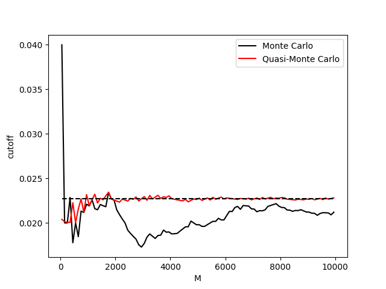
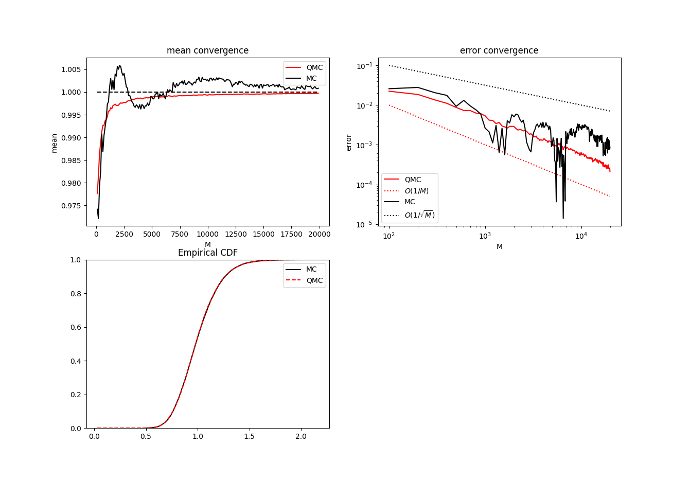

# Quasi-Monte Carlo Method

## Cutoff

Below you can see the faster convergence obtained by using Quasi-Monte Carlo method, which relies on low-discrepancy numbers rather than pseudorandom numbers.

## Stochastic Differential Equations

Quasi-Monte Carlo method can be used also with SDEs. It's important to set the number of dimensions of the low discrepancy sequence equal to the number of timesteps in the random walk.

Note how the QMC method error converges as O(1/M), while MC converges as O(1/sqrt(M)). Thus QMC has faster convergence than MC.
We also performed Kolmogorov-Smirnov test to verify that QMC and MC yield the same distributions and by looking at the p-value of the test we cannot reject the null hypothesis os same distribution between the two samples.
